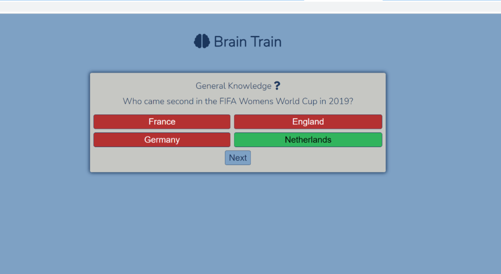

# Brain Train

Brain train is a interactive general knowledge quiz.

Users will be able to test their general knowledge skills and see whether they got the correct answer or not.

[View the live project here](https://teerapat-bickerton.github.io/Brain-Train/)

# Features

## Landing Page

* When the user arrives at the page, I wanted it to be a simple and straight forward layout where it is easy to tell what they need to do.
* On arrival on the page the user is greeted with the name of the quiz, and it tells the user it's a general knowledge quiz and also a start button to begin the quiz.

* Once the start button is pressed the first question and possible answers appear.

# Wireframes

* Desktop screen wireframe

* Mobile phone wireframe

# Technologies Used

## Languages Used

* HTML5
* CSS3
* JavaScript

## Frameworks, Libraries & Programs Used

1. Google Fonts
    * Google Fonts was used to import the Nunito font which was used throughout the page. 
2. Font Awesome
    * Font Awesome was used to get the title logo.
3. Git
    * Git was used for version control by utilizing the Gitpod terminal to commit to Git and push to GitHub.
4. GitHub 
    * GitHub is used to store the projects code after being pushed from Git.
5. Affinity Photo
    * Affinity Photo was used to resize, crop and edit photos for the README.md.
6. TinyPNG.com 
    * TinyPNG.com was used to compress images so the files were smaller.
7. Moqups
    * Moqups was used to create wireframes for the project.

# Testing 

The W3C Markup Validator, W3C CSS Validator and Extends Class JavaScript validator services were used to validate the project to ensure there were no syntax errors in the project.

* W3C Markup Validator Results

It showed an error for having an extra '</i>' in the heading which I have corrected now.

* W3C CSS Validator Results

It showed one warning that I didn't think would affect the running of the page.

* Extends Class JavaScript Validator Results

There were a few warnings, but didn't seem to affect the running of the page.

* Accessibility 

I confirmed using Lighthouse in devtools the fonts and colour chosen are accessible and legible.

## Further Testing

* The website was tested on Google Chrome, Microsoft Edge, Mozilla Firefox a Quora. It was not not tested on Safari as non of my family or friends have any Apple products.
* The website was viewed on a variety of devices such as a Desktop, Laptop, Xiaomi Poco X3 Pro, Samsung A70 and Samsung A5.

The project was deployed to GitHub using the following steps...

1. Log in to GitHub and select the appropiate repository.
2. At the top of the repository, select the "Settings" button.
3. Find the "Pages" button and press.
4. Under "Source", click on the dropdown menu and select "Main" branch.
5. THe page will automatically refresh.
6. Scroll back down through the page to locate the now published site [link](https://teerapat-bickerton.github.io/Brain-Train/) in the "GitHub Pages" section.

# Credits

## Code

* A lot code was used from https://www.youtube.com/watch?v=riDzcEQbX6k&t=1280s&ab_channel=WebDevSimplified.